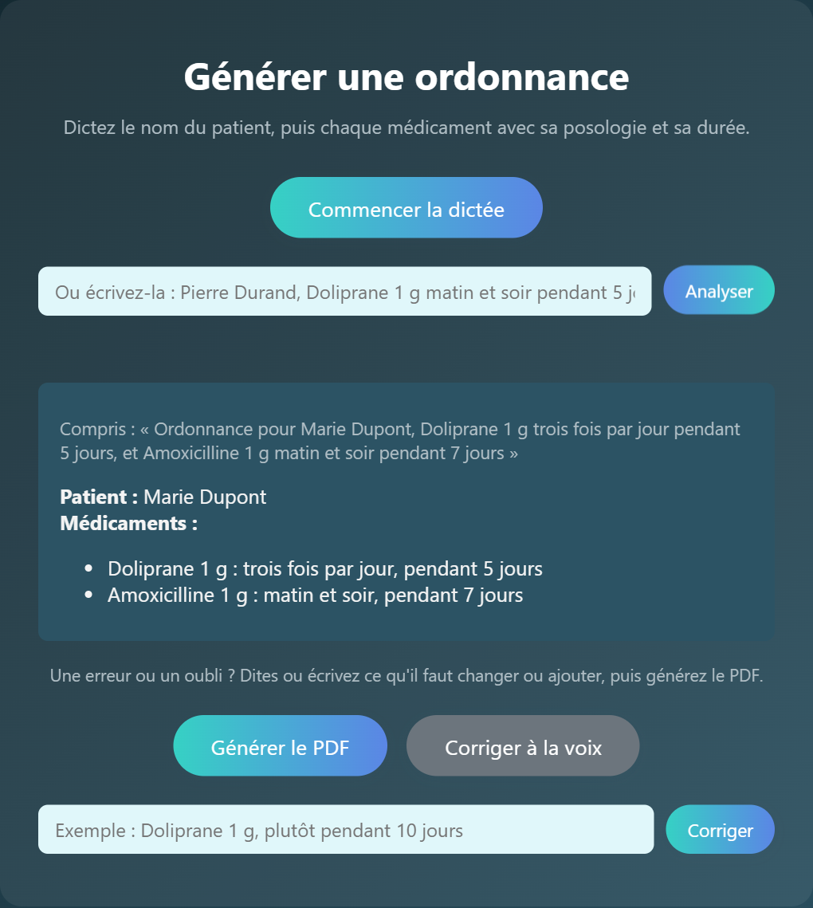
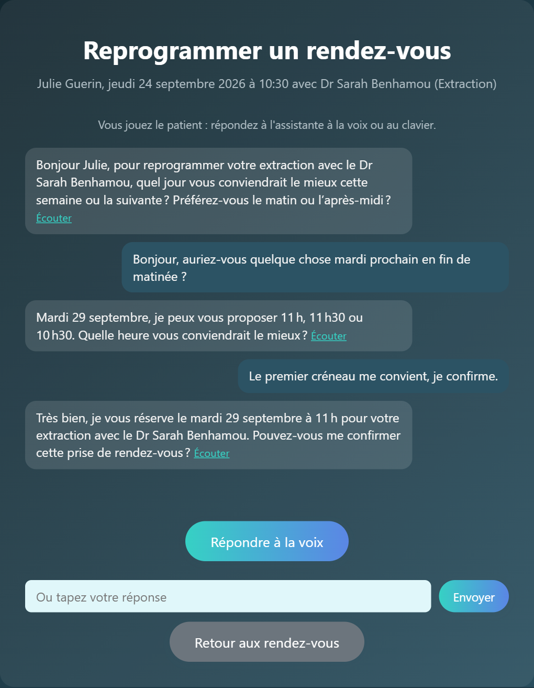
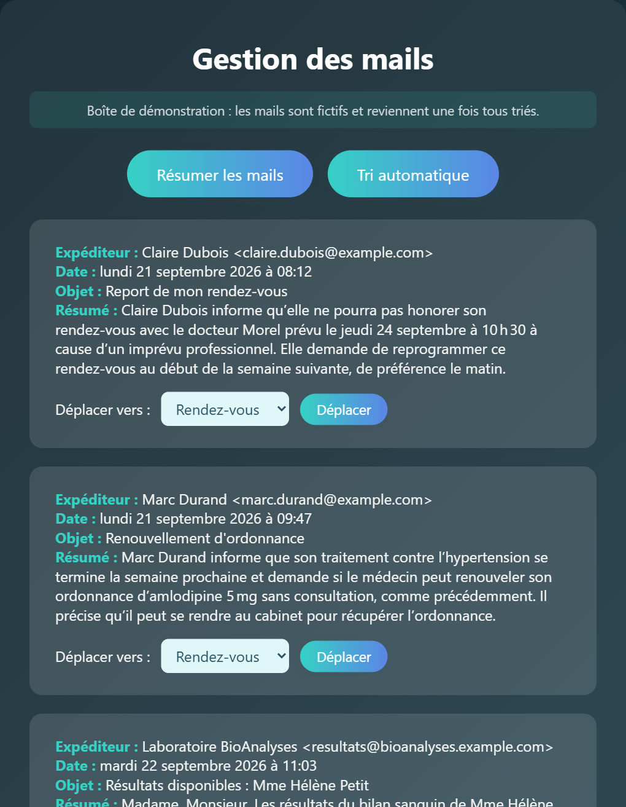

# Secretary AI

[](https://github.com/tnadiedjoa/Secretary-Ai/actions/workflows/tests.yml)
[](LICENSE)

Voice and language model assistants that take over repetitive tasks of a medical secretary: writing prescriptions from a doctor's dictation, triaging the office inbox and rescheduling appointments over a spoken conversation.

First-year engineering project at [Télécom Paris](https://www.telecom-paris.fr/), 2025. The user interface and the voice assistant speak French, since the project targets French medical practices; the code and documentation are in English.

**[Try the live demo](https://secretary-ai-7jhj.onrender.com)**: fictional patients and mailbox, voice or typed input. The free hosting sleeps when unused, so the first visit can take about a minute.

<p align="center">
  
  
  
</p>

## Features

**Voice prescriptions.** The doctor dictates a prescription in the browser. The recording is transcribed, the patient name and each medication (name, dosage, duration) are extracted as structured data, and the page shows what is still missing. The doctor can fix a mistake by voice or text ("le Doliprane, c'est pendant 7 jours et non 5"), then downloads the prescription as a PDF.

**Mail assistant.** Reads the unread emails of a Gmail inbox over IMAP without marking them as read, summarizes each one in French, and sorts them into the existing Gmail labels chosen by the model. Emails can also be moved by hand from the web page.

**Appointment planner.** Keeps the agenda of each practitioner of the office in a JSON file, with 30-minute slots from 8:00 to 12:00 and 14:00 to 18:00 on working days (French public holidays excluded), and rejects double bookings. The rescheduling agent holds a spoken conversation with the patient, only offers free slots of the same practitioner, extracts the new date once the patient has explicitly confirmed it, and checks that the slot is still free before updating the agenda.

Every voice interaction also accepts typed text, so the app can be tried without a microphone.

## How it works

The browser records the microphone with the `MediaRecorder` API and sends the audio to the Flask server, which transcribes it and returns the agent's answer. The answer is read aloud either from audio synthesized on the server or by the browser's own French voice.

Every agent talks to the models through a common interface, `BaseAIModel` (`basic`, `reflexion`, `parse`, `synthesize`, `transcribe`), so the backend can be swapped without touching the agents:

- `APIClient` works with any OpenAI-compatible API for chat, transcription and structured outputs. With OpenAI it uses `gpt-4o-mini`, `gpt-4o-mini-transcribe` and `gpt-4o-mini-tts`; with [Groq](https://groq.com/), which has a free tier, it uses `gpt-oss-120b` and `whisper-large-v3-turbo`. Google Cloud Text-to-Speech can be used for the French voice.
- `LocalClient` is an experimental implementation running Hugging Face models locally (Whisper, MMS-TTS). It keeps patient data on the machine but is not wired into the agents yet.

```
secretary_ai/
  config.py                  paths and environment variables
  ai/
    base_model.py            BaseAIModel interface and Message
    api_client.py            OpenAI, Groq and Google Cloud TTS backend
    local_client.py          experimental Hugging Face backend
    audio_controller.py      local microphone for the command line mode
  agents/
    prescription_agent.py    extraction, corrections and PDF
    mail_handler.py          Gmail access over IMAP and SMTP
    demo_mailbox.py          fictional mailbox for the public demo
    demo_calendar.py         fictional agenda for the public demo
    mail_agent.py            email summaries and sorting
    planner_controller.py    JSON agenda, practitioners and free slots
    planner_agent.py         rescheduling conversation
web/                         Flask app, templates, stylesheet and recording script
tests/                       pytest suite, no API key needed
```

The report on the societal and environmental impact of the project (data privacy, algorithmic bias, energy use) is available in [docs/secretaryai.pdf](docs/secretaryai.pdf), in French.

## Getting started

Requirements: Python 3.10 or later, an OpenAI API key or a free Groq API key (set `AI_PROVIDER=groq` and `TTS_ENGINE=browser`) and, for the mail assistant, a Gmail account with an [app password](https://myaccount.google.com/apppasswords). Setting `DEMO_MODE=1` replaces Gmail with a fictional mailbox and fills the agenda with fictional appointments, from 20 months ago to 4 months ahead, regenerated at each start.

```bash
git clone https://github.com/tnadiedjoa/Secretary-Ai.git
cd Secretary-Ai
python -m venv .venv
source .venv/bin/activate        # on Windows: .venv\Scripts\activate
pip install -r requirements.txt
cp .env.example .env             # then fill in your keys
python -m web.app
```

The app runs on http://127.0.0.1:5000, and must be started from the repository root. Browsers only give microphone access to `localhost` or HTTPS pages. Outside the demo mode the agenda starts empty; `python -m secretary_ai.agents.demo_calendar` fills it with fictional appointments.

The agents can also run in the terminal with the local microphone and speakers, for example `python -m secretary_ai.agents.prescription_agent`. This mode needs PyAudio, installed with `pip install -e ".[cli]"`. The experimental local backend is installed with `pip install -e ".[local]"`.

## Deployment

The repository ships a `Dockerfile` and a Render blueprint (`render.yaml`) for a public demo. The demo mode uses the fictional mailbox and agenda, limits each visitor to 30 AI requests per hour, and resets the agenda whenever the container restarts.

[](https://render.com/deploy?repo=https://github.com/tnadiedjoa/Secretary-Ai)

The blueprint runs on Groq's free tier with the browser's voice, so the demo costs nothing: Render only asks for a `GROQ_API_KEY`.

## Tests

```bash
pip install -e ".[dev]"
pytest
```

The tests cover the calendar logic, the rescheduling conversation, the prescription model and PDF generation, the demo mailbox, and every web route, using fake agents so that no API key, microphone or mailbox is needed. On each push, GitHub Actions also builds the Docker image and checks that the demo starts.

## Limitations

This is a prototype, not a medical product. There is no authentication, prescriptions do not carry the doctor's identifiers, and new appointments cannot be booked from the web page yet, only rescheduled. Conversations and rate limits are kept in memory, so the app runs as a single process.

## Authors

| Name | GitHub |
| --- | --- |
| Agshay Nadanakumar | [@agshayn](https://github.com/agshayn) |
| Théophile Nadiedjoa | [@tnadiedjoa](https://github.com/tnadiedjoa) |
| Antoine Ollivier | [@antoineolr](https://github.com/antoineolr) |
| Yanic Röthlingshöfer | [@yrothlin-03](https://github.com/yrothlin-03) |
| Yifan Wang | [@NafiyTP](https://github.com/NafiyTP) |

Supervised by Thomas Pujol ([@thomaspujol69](https://github.com/thomaspujol69)) and Jean-Sébastien Gomez.

## License

[MIT](LICENSE)
