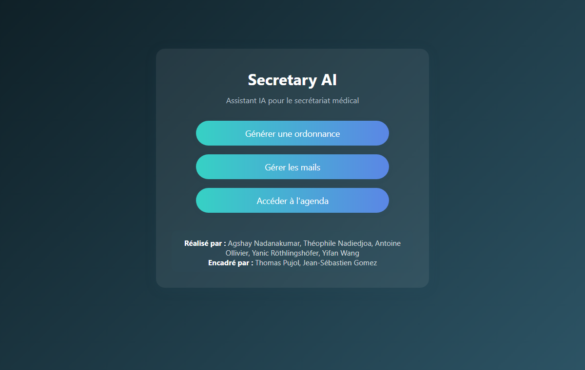
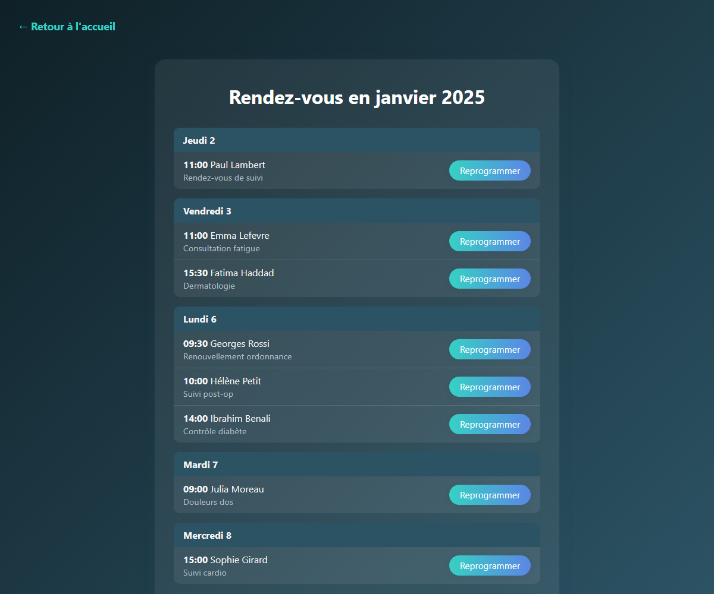
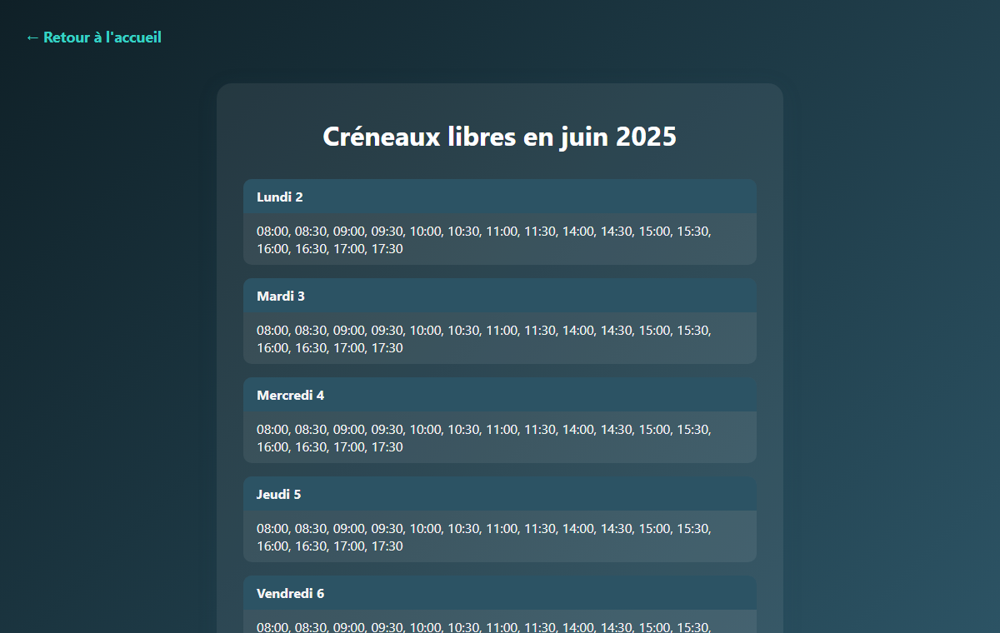

# Secretary AI

[](https://github.com/nadiedjoa-24/Secretary-Ai/actions/workflows/tests.yml)
[](LICENSE)

Voice and language model assistants that take over repetitive tasks of a medical secretary: writing prescriptions from a doctor's dictation, triaging the office inbox and rescheduling appointments over a spoken conversation.

First-year engineering project at [Télécom Paris](https://www.telecom-paris.fr/), 2025. The user interface and the voice assistant speak French, since the project targets French medical practices; the code and documentation are in English.

<p align="center">
  
  
  
</p>

## Features

**Voice prescriptions.** The doctor dictates a prescription and says "c'est tout" when done. The recording is transcribed, the patient name and each medication (name, dosage, duration) are extracted as structured data, and the doctor confirms out loud or dictates a correction ("il y a deux L à Ollivier"). The prescription is then generated as a PDF.

**Mail assistant.** Reads the unread emails of a Gmail inbox over IMAP without marking them as read, summarizes each one in French, and sorts them into the existing Gmail labels chosen by the model. Emails can also be moved by hand from the web page.

**Appointment planner.** Stores the calendar in a JSON file, with 30-minute slots on weekdays from 8:00 to 12:00 and 14:00 to 18:00, and rejects overlapping bookings. The rescheduling agent talks with the patient through the microphone, only offers free slots, extracts the new date once the patient has explicitly confirmed it, and updates the calendar.

## How it works

Every agent talks to the models through a common interface, `BaseAIModel` (`basic`, `reflexion`, `parse`, `tts`, `stt`), so the backend can be swapped without touching the agents:

- `APIClient` uses the OpenAI API for chat, transcription (`gpt-4o-mini-transcribe`) and structured outputs, and Google Cloud Text-to-Speech for a French voice.
- `LocalClient` is an experimental implementation running Hugging Face models locally (Whisper, MMS-TTS). It keeps patient data on the machine but is not wired into the agents yet.

```
secretary_ai/
  config.py                  paths and environment variables
  ai/
    base_model.py            BaseAIModel interface and Message
    api_client.py            OpenAI + Google Cloud TTS backend
    local_client.py          experimental Hugging Face backend
    audio_controller.py      microphone recording and playback
  agents/
    prescription_agent.py    dictation, extraction, confirmation, PDF
    mail_handler.py          Gmail access over IMAP and SMTP
    mail_agent.py            email summaries and sorting
    planner_controller.py    JSON calendar and free slots
    planner_agent.py         voice rescheduling agent
web/                         Flask app, templates and stylesheet
planning_json/2025.json      demo calendar with fictional patients
tests/                       pytest suite, no API key needed
```

The report on the societal and environmental impact of the project (data privacy, algorithmic bias, energy use) is available in [docs/secretaryai.pdf](docs/secretaryai.pdf), in French.

## Getting started

Requirements: Python 3.10 or later, a microphone and speakers for the voice features, an OpenAI API key, and for the mail assistant a Gmail account with an [app password](https://myaccount.google.com/apppasswords). French speech synthesis uses Google Cloud Text-to-Speech, which needs a service account key.

```bash
git clone https://github.com/nadiedjoa-24/Secretary-Ai.git
cd Secretary-Ai
python -m venv .venv
source .venv/bin/activate        # on Windows: .venv\Scripts\activate
pip install -r requirements.txt
cp .env.example .env             # then fill in your keys
python -m web.app
```

The app runs on http://127.0.0.1:5000. Commands must be run from the repository root. Each agent can also be tried from the terminal, for example `python -m secretary_ai.agents.prescription_agent`.

To try the experimental local backend, install `requirements-local.txt` instead.

## Tests

```bash
pip install -r requirements-dev.txt
pytest
```

The tests cover the calendar logic, the rescheduling slots, the prescription model and PDF generation, and every web route, using fake agents so that no API key, microphone or mailbox is needed.

## Limitations

This is a prototype, not a medical product. The voice features use the microphone and speakers of the machine running the server, so the web app is meant for a local demo by a single user. There is no authentication, prescriptions do not carry the doctor's identifiers, and the calendar is a demo file for the year 2025.

## Authors

| Name | GitHub |
| --- | --- |
| Agshay Nadanakumar | [@agshayn](https://github.com/agshayn) |
| Théophile Nadiedjoa | [@nadiedjoa-24](https://github.com/nadiedjoa-24) |
| Antoine Ollivier | [@antoineolr](https://github.com/antoineolr) |
| Yanic Röthlingshöfer | [@yrothlin-03](https://github.com/yrothlin-03) |
| Yifan Wang | [@NafiyTP](https://github.com/NafiyTP) |

Supervised by Thomas Pujol ([@thomaspujol69](https://github.com/thomaspujol69)) and Jean-Sébastien Gomez.

## License

[MIT](LICENSE)
